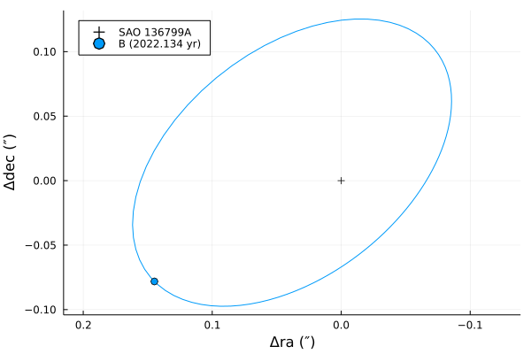

# Orbits.jl

[](https://github.com/juliaastro/Orbits.jl/actions)
[](https://juliaci.github.io/NanosoldierReports/pkgeval_badges/report.html)
[](https://codecov.io/gh/juliaastro/Orbits.jl)
[](https://opensource.org/licenses/MIT)

[](https://juliaastro.github.io/Orbits.jl/stable)
[](https://juliaastro.github.io/Orbits.jl/dev)

Flexible and fast astronomical orbits (originally a submodule of [Transits.jl](https://github.com/JuliaAstro/Transits.jl)).

The goals of this package are, in this order:
* have a simple interface with high *composability*
* be flexible with respect to numeric types and application
* be fully compatible with [ChainRules.jl](https://github.com/juliadiff/ChainRules.jl) automatic differentiation (AD) system to leverage the derived analytical gradients
* provide a codebase that is well-organized, instructive, and easy to extend
* maintain high performance: at least as fast as similar tools

## Installation

To install use [Pkg](https://julialang.github.io/Pkg.jl/v1/managing-packages/). From the REPL, press `]` to enter Pkg-mode

```julia
pkg> add Orbits
```
If you want to use the most up-to-date version of the code, check it out from `main`

```julia
pkg> add Orbits#main
```

## Usage

```julia
using Orbits
using Plots
using Unitful, UnitfulAstro
using UnitfulRecipes

# orbital params for SAO 136799
distance = inv(6.92e-3)u"pc"

orbit = KeplerianOrbit(;
    period = 40.57u"yr",
    ecc = 0.42,
    Omega = 318.6u"°",
    tp = 1972.12u"yr",
    incl = 54.7u"°",
    a = 0.154u"arcsecond" * distance |> u"AU",
    omega = 72.6u"°",
)

# get position at specific time
t = 2022.134u"yr"
pos = relative_position(orbit, t)
ra_off, dec_off = @. pos[1:2] / distance |> u"arcsecond"
```

```julia
2-element Vector{Quantity{Float64, NoDims, Unitful.FreeUnits{(″,), NoDims, nothing}}}:
  0.14482641030730156 ″
 -0.07816487001285195 ″
```

---
```julia
# plot using Unitful recipes
plot(orbit; distance, label="SAO 136799", leg=:topleft)
scatter!([0u"arcsecond" ra_off], [0u"arcsecond" dec_off],
          c=[:black 1], m=[:+ :o], lab=["A" "B"])
```



---
```julia
pa = round(Orbits.position_angle(orbit, t), sigdigits=5)
sep = round(u"AU", Orbits.separation(orbit, t), sigdigits=5)
pa, sep
```

```
(118.36, 23.782 AU)
```

## Contributing and Support

If you would like to contribute, feel free to open a [pull request](https://github.com/JuliaAstro/Orbits.jl/pulls). If you want to discuss something before contributing, head over to [discussions](https://github.com/JuliaAstro/Orbits.jl/discussions) and join or open a new topic.
